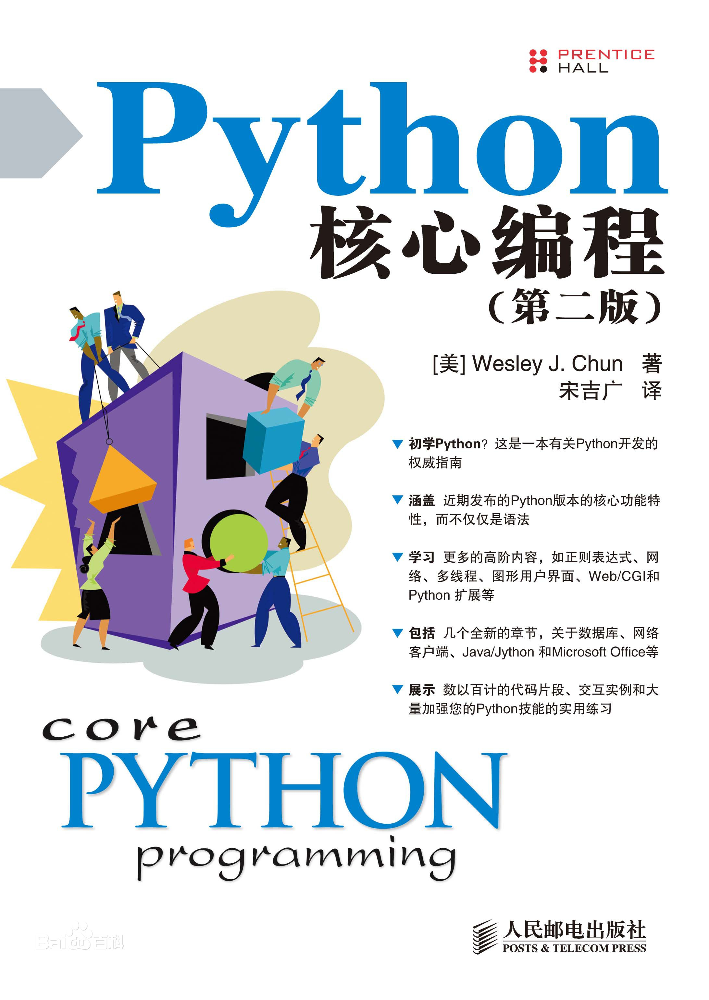
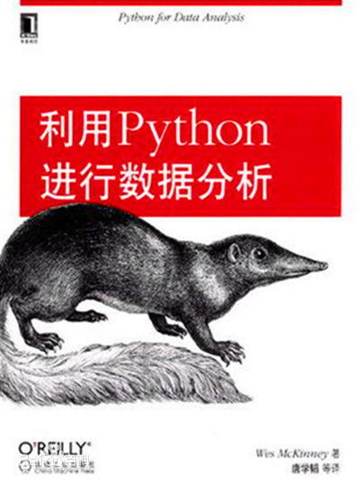
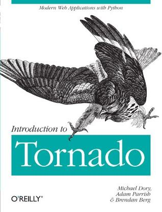
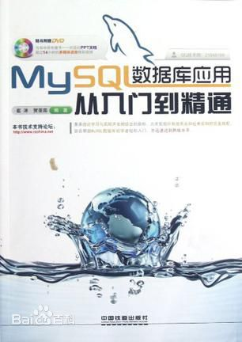
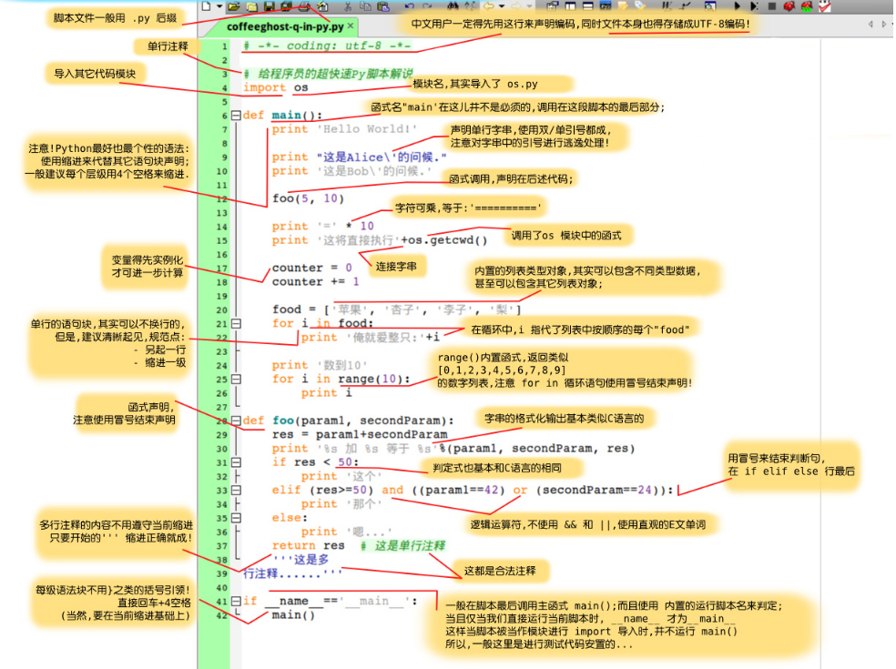

# **后端入门--Python及相关的一些简单介绍**

+ *目录*
    - [推荐图书](#book)
    - [一些学习论坛，刷题网站](#forum)
    - [编辑器](#ide)
    - [标准库](#library)
    - [web框架](#frame)
    - [数据库](#datebase)
    - [一些小例子](#project)
    - [作业](#homework)

-------

## ***相关书籍资料*** 

### 1. [**python基础教程**](http://download.csdn.net/download/hpang1983/2735470)

### 2.[**python核心编程**](http://download.csdn.net/download/lwl8881081/9963557)

### 3.[**利用python进行数据分析**](http://download.csdn.net/download/laoge/8151775)

### 4.[**Introduce to Tornado**](http://vdisk.weibo.com/s/zoP5bfzQ0U2K4)

### 5.[**MySQL数据库应用从入门到精通**](http://download.csdn.net/download/javajeep/9626172)

***ps:***

>自己喜欢什么网上了解一下评价自己找书看就好。书有书的好处，网上的博客教程有教程的好处
-------

## ***论坛，oj网站*** 

### 1.[**csdn**](http://www.csdn.net/)

> 东西很多很多，书籍资料，技术文章，相关新闻，课设代码...

### 2.[**runoob**](http://www.runoob.com/)

> 许多技术入门教程技术文档...

### 3.[**简书**](http://www.jianshu.com/)

> 啥也有，自己关注喜欢的博主吧...

### 4.[**segmentfault**](https://segmentfault.com/)

> 社区，各种东西

### 5.[**leetcode**](https://leetcode.com/)

> 刷python题的话这个比较好。以后还会遇到各种刷题的网站，看自己喜好吧

***ps:***

> 有很多类似网站，各有侧重，也各有各的特色，也一定还有更好的社区，自己去发现吧
-------

## ***编辑器*** 

+ vscode
    > 越来越完善，界面好看

+ sublime
    > 插件多且全，比vscode要小而快。但是插件装多了就....

+ pycharm
    > 用来进行python开发的ide，比较臃肿，但是功能强大，属实好用，就是电脑不行会卡顿

+ ipython
    > 用来进行一些代码块的测试什么的很好用，小巧，基本功能比原生的pythonide要好用

***ps:***
> 我只列举一些我用的代码编辑器。还有比较有名的notepad++，atom等等，就看个人喜好了
-------

## ***标准库和第三方库*** 

> 我们后端开发用的是python，本身比较容易上手，同时他有许多库供大家使用，加快了开发效率。列举几个库:
+ os:路径相关模块
    > 1.os.getcwd()：获得当前工作目录  
    2.os.path.abspath(name):获得绝对路径

+ time,datetime:时间处理模块
    > 1.time.localtime()
    <pre>In [3]: time.localtime()
    Out[3]: time.struct_time(tm_year=2017, tm_mon=9, tm_mday=21, tm_hour=12, tm_min=7, tm_sec=54, tm_wday=3, tm_yday=264, tm_isdst=0)</code>

+ pandas:非常强大的数据处理和科学计算库

+ threading和multiprocessing：多线程，多进程

+ re：正则模块，处理爬虫时这个模块会频繁使用

+ urllib/urllib2/httplib：http库，httplib底层一点，推荐第三方的库requests。爬虫也会用到

+ cProfile：python性能测量模块
    > 测试你代码所用时间，哪个函数用的时间长，语句用了多少次等等
-------

## ***web服务器框架*** 

### tornado

> 现在我们组使用的后端的服务器框架就是tornado，速度快，
每秒可以处理的请求多，性能优势明显，并发处理较好[了解更多](https://baike.baidu.com/item/Tornado/13779735?fr=aladdin)。  
用tornado和ajax就可以架起前后端交互的桥梁（方式很多，提大家接触过的）

### Django

> 重量级web框架，相对难上手

### Flask

> 和tornado一样是轻量级的web框架，这三个中最简单，但是并发处理上不及tornado
--------

## ***数据库*** 

### Mysql

> 关系型数据库，需要大家学习的数据库，平时开发也用这个。想用容易，理解为什么很难

### Mongodb

> 非关系型数据库，项目需求不同也会用到

* [Mongodb和Mysql的区别](http://www.cnblogs.com/wangwanchao/p/5807630.html)

###　Redis

>　缓存数据库，读写迅速。直播弹幕的处理好多用到redis

--------

## ***小例子*** 

>一个图片来介绍一下一些代码都干了什么[图片](Pictures/example.jpg)

#### python入门练手小例子
> 1.写一个小爬虫，获取数据放到文件  
2.实现一个自己喜欢的算法  
3.找一些自己喜欢的库来体会一下他的高效
>> ps:爬虫，遗传算法，pandas实例，tornado的demo代码在Demo文件夹下
--------

## ***作业*** 

1. 计算一个文件中的单词数量，用尽可能多的方法，用尽可能不一样的代码（同样的思路也可以用不同的代码来表达，函数式编程），用尽可能不一样的库来写

2. 写一个爬虫来爬取观海灌水区的帖子标题和时间(时间：发帖时间，不可以是最后编辑时间，这一项作为本项作业的加分项)，爬50页，存到一个excel表中，表项需要有id，title，date（有能力把这些存到数据库里面，不需要设计库，在自己的库下建一个最简单的表就行，不做硬性要求）。

3. a.说说为什么demo里/login登录才有反应b.ajax,tornado和最基本的html在本地实现一个小网站，多个页面（如果可以在页面间实现跳转，而不是url），不做页面样式的要求。

> ***等级要求：***
>> 17级完成1.即可，2.作为加分项  
16级完成1.，2.项，3.作为加分项  
15级希望可以全部完成

### ***ps：***

> 希望大家可以系统的看看书，或者过一遍教程。基础打好了看代码也就快了。加油